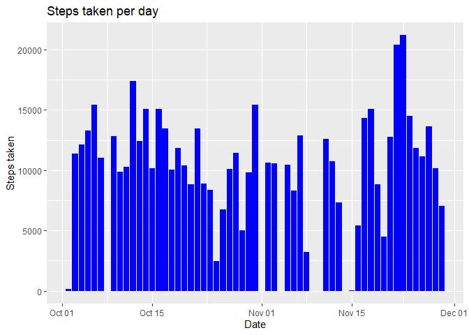
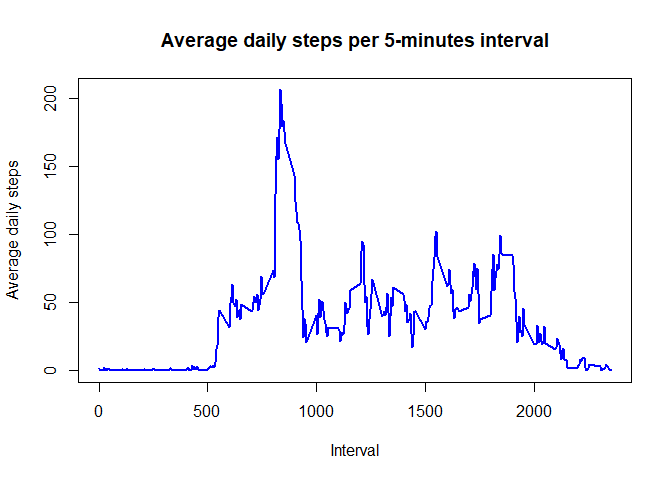
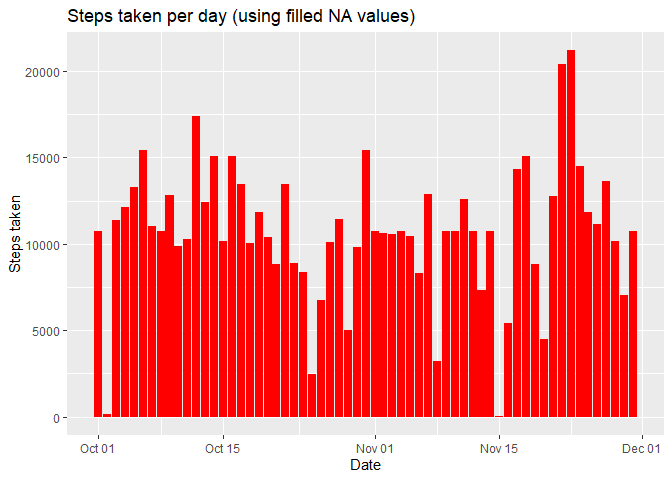
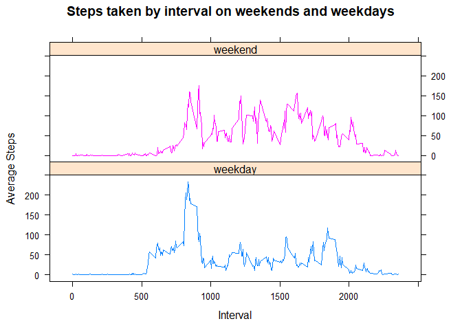

## Loading and preprocessing the data  
...       
Here I change my locale to English, load the libraries I am going to use, unzip the file and load the file to a new variable called activity_data. There is a little transformation of the date column to be a date type column.  
...  


```r
Sys.setlocale("LC_TIME", "English")
```

```
## [1] "English_United States.1252"
```

```r
library(scales)
library(dplyr)
```

```
## 
## Attaching package: 'dplyr'
```

```
## The following objects are masked from 'package:stats':
## 
##     filter, lag
```

```
## The following objects are masked from 'package:base':
## 
##     intersect, setdiff, setequal, union
```

```r
library(ggplot2)
library(lattice)
file <- unzip("activity.zip")
activity_data <- read.csv(file, header=TRUE, sep=",")
activity_data$date <- as.Date(activity_data$date)
```
...  

## What is mean total number of steps taken per day?
...       
In the following code I am answering the question "What is the mean total number of steps taken per day?". I just group the activity data by date and display the results.  
...  

```r
activity_data %>% dplyr::group_by(date) %>% dplyr::summarize(sum_steps=sum(steps, na.rm=TRUE), .groups="keep") %>% print(n=Inf)
```

```
## # A tibble: 61 x 2
## # Groups:   date [61]
##    date       sum_steps
##    <date>         <int>
##  1 2012-10-01         0
##  2 2012-10-02       126
##  3 2012-10-03     11352
##  4 2012-10-04     12116
##  5 2012-10-05     13294
##  6 2012-10-06     15420
##  7 2012-10-07     11015
##  8 2012-10-08         0
##  9 2012-10-09     12811
## 10 2012-10-10      9900
## 11 2012-10-11     10304
## 12 2012-10-12     17382
## 13 2012-10-13     12426
## 14 2012-10-14     15098
## 15 2012-10-15     10139
## 16 2012-10-16     15084
## 17 2012-10-17     13452
## 18 2012-10-18     10056
## 19 2012-10-19     11829
## 20 2012-10-20     10395
## 21 2012-10-21      8821
## 22 2012-10-22     13460
## 23 2012-10-23      8918
## 24 2012-10-24      8355
## 25 2012-10-25      2492
## 26 2012-10-26      6778
## 27 2012-10-27     10119
## 28 2012-10-28     11458
## 29 2012-10-29      5018
## 30 2012-10-30      9819
## 31 2012-10-31     15414
## 32 2012-11-01         0
## 33 2012-11-02     10600
## 34 2012-11-03     10571
## 35 2012-11-04         0
## 36 2012-11-05     10439
## 37 2012-11-06      8334
## 38 2012-11-07     12883
## 39 2012-11-08      3219
## 40 2012-11-09         0
## 41 2012-11-10         0
## 42 2012-11-11     12608
## 43 2012-11-12     10765
## 44 2012-11-13      7336
## 45 2012-11-14         0
## 46 2012-11-15        41
## 47 2012-11-16      5441
## 48 2012-11-17     14339
## 49 2012-11-18     15110
## 50 2012-11-19      8841
## 51 2012-11-20      4472
## 52 2012-11-21     12787
## 53 2012-11-22     20427
## 54 2012-11-23     21194
## 55 2012-11-24     14478
## 56 2012-11-25     11834
## 57 2012-11-26     11162
## 58 2012-11-27     13646
## 59 2012-11-28     10183
## 60 2012-11-29      7047
## 61 2012-11-30         0
```

...       
Here is the corresponding histogram showing the total number of steps taken each day.
...  

```r
ggplot(data=activity_data,aes(x=date,y=steps)) + geom_histogram(stat="identity", fill="blue") + labs(x="Date", y="Steps taken", title ="Steps taken per day")
```

```
## Warning: Ignoring unknown parameters: binwidth, bins, pad
```

```
## Warning: Removed 2304 rows containing missing values (position_stack).
```

<!-- -->

...       
Now showing what the mean and median of the total number of steps taken per day.
...  

```r
activity_data %>% dplyr::group_by(date) %>% dplyr::summarize(mean_steps=mean(steps, na.rm=TRUE), median_steps=median(steps, na.rm=TRUE)) %>% print(n=Inf)
```

```
## `summarise()` ungrouping output (override with `.groups` argument)
```

```
## # A tibble: 61 x 3
##    date       mean_steps median_steps
##    <date>          <dbl>        <dbl>
##  1 2012-10-01    NaN               NA
##  2 2012-10-02      0.438            0
##  3 2012-10-03     39.4              0
##  4 2012-10-04     42.1              0
##  5 2012-10-05     46.2              0
##  6 2012-10-06     53.5              0
##  7 2012-10-07     38.2              0
##  8 2012-10-08    NaN               NA
##  9 2012-10-09     44.5              0
## 10 2012-10-10     34.4              0
## 11 2012-10-11     35.8              0
## 12 2012-10-12     60.4              0
## 13 2012-10-13     43.1              0
## 14 2012-10-14     52.4              0
## 15 2012-10-15     35.2              0
## 16 2012-10-16     52.4              0
## 17 2012-10-17     46.7              0
## 18 2012-10-18     34.9              0
## 19 2012-10-19     41.1              0
## 20 2012-10-20     36.1              0
## 21 2012-10-21     30.6              0
## 22 2012-10-22     46.7              0
## 23 2012-10-23     31.0              0
## 24 2012-10-24     29.0              0
## 25 2012-10-25      8.65             0
## 26 2012-10-26     23.5              0
## 27 2012-10-27     35.1              0
## 28 2012-10-28     39.8              0
## 29 2012-10-29     17.4              0
## 30 2012-10-30     34.1              0
## 31 2012-10-31     53.5              0
## 32 2012-11-01    NaN               NA
## 33 2012-11-02     36.8              0
## 34 2012-11-03     36.7              0
## 35 2012-11-04    NaN               NA
## 36 2012-11-05     36.2              0
## 37 2012-11-06     28.9              0
## 38 2012-11-07     44.7              0
## 39 2012-11-08     11.2              0
## 40 2012-11-09    NaN               NA
## 41 2012-11-10    NaN               NA
## 42 2012-11-11     43.8              0
## 43 2012-11-12     37.4              0
## 44 2012-11-13     25.5              0
## 45 2012-11-14    NaN               NA
## 46 2012-11-15      0.142            0
## 47 2012-11-16     18.9              0
## 48 2012-11-17     49.8              0
## 49 2012-11-18     52.5              0
## 50 2012-11-19     30.7              0
## 51 2012-11-20     15.5              0
## 52 2012-11-21     44.4              0
## 53 2012-11-22     70.9              0
## 54 2012-11-23     73.6              0
## 55 2012-11-24     50.3              0
## 56 2012-11-25     41.1              0
## 57 2012-11-26     38.8              0
## 58 2012-11-27     47.4              0
## 59 2012-11-28     35.4              0
## 60 2012-11-29     24.5              0
## 61 2012-11-30    NaN               NA
```

## What is the average daily activity pattern?
...       
Here I show a plot of the daily activity pattern with the 5-minutes interval as the x-axis value. To do that I decided to create a new DF called avg_daily_pattern and grouping by interval.
...  

```r
avg_daily_pattern <- activity_data %>% dplyr::group_by(interval) %>% dplyr::summarize(avg_steps=mean(steps, na.rm = TRUE))
```

```
## `summarise()` ungrouping output (override with `.groups` argument)
```

```r
plot(avg_daily_pattern$interval, avg_daily_pattern$avg_steps, type="l", xlab="Interval", ylab="Average daily steps", col="blue", lwd=2, main="Average daily steps per 5-minutes interval")
```

<!-- -->

...       
Here is the interval with the maximum number of steps.  
...    

```r
avg_daily_pattern %>% filter(avg_steps == max(avg_steps))
```

```
## # A tibble: 1 x 2
##   interval avg_steps
##      <int>     <dbl>
## 1      835      206.
```

## Imputing missing values
...       
List of the rows with missing values.
...

```r
sum(!complete.cases(activity_data))
```

```
## [1] 2304
```

...       
The strategy to fill the missing values is simple. Just replace the NAs with the average of steps in the giving interval. As result I created a new DF called activity_data_fill
...

```r
avg_pattern <- function(x) replace(x, is.na(x), mean(x, na.rm=TRUE))

activity_data_fill <- plyr::ddply(activity_data, ~interval, transform, steps = avg_pattern(steps))

#activity_data_fill[order(activity_data_fill$date), ]
```

...       
Histogram showing the total number of steps taken each day.
...

```r
ggplot(data=activity_data_fill,aes(x=date,y=steps))+ geom_bar(stat="identity", fill="red") + labs(x="Date", y="Steps taken", title="Steps taken per day (using filled NA values)")
```

<!-- -->

...       
Report of the mean and median total number of steps taken per day. Here we can see that the values doesn't differ from the values of the first part of the assignment. There is no impact in the imputing of values to the NAs
...

```r
adf_mean_steps <- activity_data_fill %>% dplyr::group_by(date) %>% dplyr::summarize(mean_steps=mean(steps, na.rm=TRUE), median_steps=median(steps, na.rm=TRUE))
```

```
## `summarise()` ungrouping output (override with `.groups` argument)
```

```r
adf_mean_steps %>% print(n=Inf)
```

```
## # A tibble: 61 x 3
##    date       mean_steps median_steps
##    <date>          <dbl>        <dbl>
##  1 2012-10-01     37.4           34.1
##  2 2012-10-02      0.438          0  
##  3 2012-10-03     39.4            0  
##  4 2012-10-04     42.1            0  
##  5 2012-10-05     46.2            0  
##  6 2012-10-06     53.5            0  
##  7 2012-10-07     38.2            0  
##  8 2012-10-08     37.4           34.1
##  9 2012-10-09     44.5            0  
## 10 2012-10-10     34.4            0  
## 11 2012-10-11     35.8            0  
## 12 2012-10-12     60.4            0  
## 13 2012-10-13     43.1            0  
## 14 2012-10-14     52.4            0  
## 15 2012-10-15     35.2            0  
## 16 2012-10-16     52.4            0  
## 17 2012-10-17     46.7            0  
## 18 2012-10-18     34.9            0  
## 19 2012-10-19     41.1            0  
## 20 2012-10-20     36.1            0  
## 21 2012-10-21     30.6            0  
## 22 2012-10-22     46.7            0  
## 23 2012-10-23     31.0            0  
## 24 2012-10-24     29.0            0  
## 25 2012-10-25      8.65           0  
## 26 2012-10-26     23.5            0  
## 27 2012-10-27     35.1            0  
## 28 2012-10-28     39.8            0  
## 29 2012-10-29     17.4            0  
## 30 2012-10-30     34.1            0  
## 31 2012-10-31     53.5            0  
## 32 2012-11-01     37.4           34.1
## 33 2012-11-02     36.8            0  
## 34 2012-11-03     36.7            0  
## 35 2012-11-04     37.4           34.1
## 36 2012-11-05     36.2            0  
## 37 2012-11-06     28.9            0  
## 38 2012-11-07     44.7            0  
## 39 2012-11-08     11.2            0  
## 40 2012-11-09     37.4           34.1
## 41 2012-11-10     37.4           34.1
## 42 2012-11-11     43.8            0  
## 43 2012-11-12     37.4            0  
## 44 2012-11-13     25.5            0  
## 45 2012-11-14     37.4           34.1
## 46 2012-11-15      0.142          0  
## 47 2012-11-16     18.9            0  
## 48 2012-11-17     49.8            0  
## 49 2012-11-18     52.5            0  
## 50 2012-11-19     30.7            0  
## 51 2012-11-20     15.5            0  
## 52 2012-11-21     44.4            0  
## 53 2012-11-22     70.9            0  
## 54 2012-11-23     73.6            0  
## 55 2012-11-24     50.3            0  
## 56 2012-11-25     41.1            0  
## 57 2012-11-26     38.8            0  
## 58 2012-11-27     47.4            0  
## 59 2012-11-28     35.4            0  
## 60 2012-11-29     24.5            0  
## 61 2012-11-30     37.4           34.1
```

## Are there differences in activity patterns between weekdays and weekends?
...       
I created a new factor variable in the activity data DF, called day_type to show if a day is a week day or a weekend day
...

```r
weekday_list <- c('Monday', 'Tuesday', 'Wednesday', 'Thursday', 'Friday')

activity_data["day_type"] <- c("weekend", "weekday")[(weekdays(activity_data$date) %in% weekday_list)+1L]
```

...       
Drawing a plot using the lattice system showing the patterns between weekdays and weekends
...

```r
avg_daily_pattern_wd <- activity_data %>% dplyr::group_by(interval, day_type) %>% dplyr::summarize(avg_steps=mean(steps, na.rm = TRUE))
```

```
## `summarise()` regrouping output by 'interval' (override with `.groups` argument)
```

```r
xyplot(avg_steps~interval|day_type, data=avg_daily_pattern_wd, groups=day_type, type="l", layout=c(1,2), main="Steps taken by interval on weekends and weekdays", ylab="Average Steps", xlab="Interval")
```

<!-- -->

